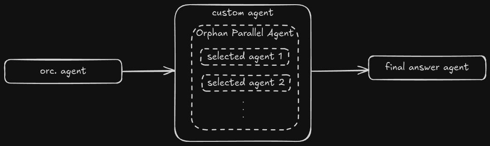
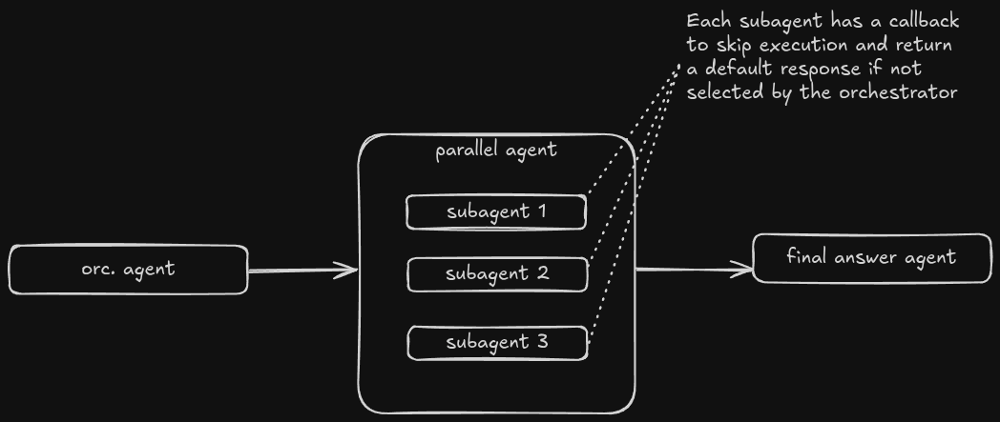
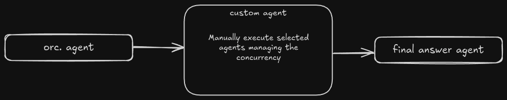

+++
date = '2026-05-31T19:08:23+05:30'
draft = true
title = 'ADK Dynamic Parallel Agents'
tags = ["programming", "agents", "adk"]
+++

## Background

Recently, I have been working on a project that had a requirement to run multiple AI agents in parallel. The project was built using [Google ADK](https://adk.dev) (Agent Development Kit).

That's easy right? Doesn't ADK already provide a built-in [ParallelAgent](https://adk.dev/agents/workflow-agents/parallel-agents/) that can run multiple agents in parallel?

Yes, it does. However, the built-in `ParallelAgent` accepts a fixed list of agents to run in parallel. The requirement was to be able to dynamically select and execute a variable number of agents based on user input parallelly.

I did a bit of research and experimentation. I thought of sharing the different approaches I came up with in case anyone else is trying to solve a similar problem.


The full code samples for the solutions discussed in this post can be found in this GitHub repository: [ADK Dynamic Parallel Agents](https://github.com/nimanthadilz/adk-dynamic-parallel-agents)


## Problem Statement

An orchestrator agent receives user input and based on that input, it needs to select a subset of available agents to run in parallel. The number of agents to run can vary each time based on the user query.

By nature, as the a final step, we need to merge the results from all the parallel agents and return a consolidated response to the user.

## Sequential Nature of the Problem

Above problem statement can be broken down into the following sequential steps:

1. Orchestrator agent receives user input and determines which agents to run.
2. Selected agents are executed in parallel.
3. Results from parallel agents are merged.


graph LR;
A[Orchestrator]-->B[Parallel Execution of Selected Agents]-->C[Merging Results];


This signals that this is a good use case for the built-in `SequentialAgent` from ADK. It is the 2nd step that we have to figure out.

## Solutions

I came up with 3 different solutions to solve the dynamic parallel execution part of the problem. Let's walk through each of them one by one.

### Solution #1 - Orphan Parallel Agent

Here, the basic idea it to use a custom agent in ADK that would create and run a new `ParallelAgent` instance with the selected agents each time it is called.



The custom agent implementation would look something like this:




```python {linenos=true}
class SalesOrphanParallelExecutorAgent(BaseAgent):
    @override
    async def _run_async_impl(
        self,
        ctx: InvocationContext,
    ) -> AsyncGenerator[Event, None]:
        selected_names = ctx.session.state.get(SELECTED_SUBAGENTS_KEY, [])
        if isinstance(selected_names, BaseModel):
            selected_names = getattr(selected_names, "selected_subagent_names", [])
        elif isinstance(selected_names, dict):
            selected_names = selected_names.get("selected_subagent_names", [])

        normalized_names: list[str] = []
        for selected_name in selected_names:
            name = getattr(selected_name, "value", selected_name)
            if isinstance(name, str) and name not in normalized_names:
                normalized_names.append(name)

        runtime_subagents = [
            subagent
            for name in normalized_names
            if (subagent := _build_runtime_subagent(name)) is not None
        ]

        logger.info("Selected subagents: %s", normalized_names)

        if not runtime_subagents:
            return

        parallel_agent = ParallelAgent(
            name=f"sales_runtime_parallel_{ctx.invocation_id.replace('-', '_')}",
            sub_agents=runtime_subagents,
        )

        async for event in parallel_agent.run_async(ctx):
            yield event
```




In above code, the orchestrator agent has already stored the list of selected agents in the session state. The custom agent retrieves that list, builds a new `ParallelAgent` instance with those agents, and runs it.

> [!question]- Why agents passed to the `ParallelAgent` are created at runtime?
> The reason for creating the agents that are passed to the `ParallelAgent` at runtime (instead of creating them beforehand and just passing the names) is that when we once pass an agent to a `ParallelAgent`, that agent becomes owned by the `ParallelAgent` and cannot be reused in another `ParallelAgent` instance.
>
> As ADK [docs](https://adk.dev/agents/custom-agents/#agent-hierarchy-parent-agents-and-sub-agents) mention, _"Single Parent Rule: An agent instance can only be added as a sub-agent once. Attempting to assign a second parent will result in a ValueError."_
>
> If you try to do that, you will get an error like this:
>
> ```
> pydantic_core._pydantic_core.ValidationError: 1 validation error for ParallelAgent
>  Value error, Agent `product_inventory_agent` already has a parent agent, current parent: 'sales_runtime_parallel_e_5991db5d_2bbe_48ba_b27e_90fd43fc405e', trying to add: `sales_runtime_parallel_e_3ca3d5dd_d483_4973_ab86_9ce3ea4eac44` [type=value_error, input_value={'name': 'sales_runtime_p...l_error_callback=None)]}, input_type=dict]
> ```

### Solution #2 - Fixed Parallel Agent with Skip Logic

Another solution is to create a fixed `ParallelAgent` with all the possible agents that can run in parallel, and then use some logic to skip the execution of agents that are not selected by the orchestrator agent.

A good place for this skip logic is the `before_agent_callback` of each of those parallelly exeuctable agents.



I have used below utility function to generate a callback with skip logic for a given agent name:

```python {linenos=true}
def _skip_if_not_selected(agent_name: str):
    def callback(callback_context: Context):
        selected_names = _extract_selected_names(
            callback_context.state.get(SELECTED_SUBAGENTS_KEY, [])
        )
        if agent_name in selected_names:
            return None

        logger.info("Skipping subagent %s (not selected by orchestrator)", agent_name)
        return types.Content(
            role="model",
            parts=[types.Part(text=f"{SKIP_MARKER_PREFIX}{agent_name}")],
        )

    return callback
```

Each agent will be passed above callback in its `before_agent_callback`. For example:

```python {linenos=true}
product_search_agent = Agent(
    name=SalesSubagentName.PRODUCT_SEARCH.value,
    model=MODEL,
    instruction="""...""",
    tools=[search_products],
    output_key="temp:product_search_agent_output",
    before_agent_callback=_skip_if_not_selected(SalesSubagentName.PRODUCT_SEARCH.value),
)
```

Parallel agent & root sequential agents will look like this:

```python {linenos=true}
parallel_agent = ParallelAgent(
    name="sales_parallel_agent",
    sub_agents=[
        product_search_agent,
        product_inventory_agent,
        order_agent,
    ],
)

root_agent = SequentialAgent(
    name="sales_assistant_sequential_root",
    sub_agents=[
        orchestrator_agent,
        parallel_agent,
        final_answer_agent,
    ],
)

```

### Solution #3 - Custom Agent with Manual Parallel Execution

In this approach, we create a custom agent that manually runs the selected agents in parallel using Python's `asyncio` library - TaskGroups in particular.






```python {linenos=true}
async def _merge_agent_runs(
    agent_runs: list[AsyncGenerator[Event, None]],
) -> AsyncGenerator[Event, None]:
    sentinel = object()
    queue: asyncio.Queue[tuple[Event | object, asyncio.Event | None]] = asyncio.Queue()

    async def process_single_run(agent_run: AsyncGenerator[Event, None]) -> None:
        try:
            async for event in agent_run:
                resume_signal = asyncio.Event()
                await queue.put((event, resume_signal))
                await resume_signal.wait()
        finally:
            await queue.put((sentinel, None))

    async with asyncio.TaskGroup() as task_group:
        for agent_run in agent_runs:
            task_group.create_task(process_single_run(agent_run))

        sentinel_count = 0
        while sentinel_count < len(agent_runs):
            event_or_sentinel, resume_signal = await queue.get()
            if event_or_sentinel is sentinel:
                sentinel_count += 1
                continue
            yield cast(Event, event_or_sentinel)
            assert resume_signal is not None
            resume_signal.set()


class SalesParallelExecutorAgent(BaseAgent):
    product_search_agent: LlmAgent
    product_inventory_agent: LlmAgent
    order_agent: LlmAgent

    def model_post_init(self, __context: object) -> None:
        self.sub_agents = [
            self.product_search_agent,
            self.product_inventory_agent,
            self.order_agent,
        ]

    @override
    async def _run_async_impl(
        self,
        ctx: InvocationContext,
    ) -> AsyncGenerator[Event, None]:
        selected_names = ctx.session.state.get(SELECTED_SUBAGENTS_KEY, [])
        if isinstance(selected_names, BaseModel):
            selected_names = getattr(selected_names, "selected_subagent_names", [])
        elif isinstance(selected_names, dict):
            selected_names = selected_names.get("selected_subagent_names", [])

        normalized_names: list[str] = []
        for selected_name in selected_names:
            name = getattr(selected_name, "value", selected_name)
            if isinstance(name, str) and name not in normalized_names:
                normalized_names.append(name)

        agent_registry = {
            self.product_search_agent.name: self.product_search_agent,
            self.product_inventory_agent.name: self.product_inventory_agent,
            self.order_agent.name: self.order_agent,
        }
        selected_agents = [
            agent_registry[name] for name in normalized_names if name in agent_registry
        ]

        logger.info("Selected subagents: %s", normalized_names)

        if not selected_agents:
            return

        branch_runs: list[AsyncGenerator[Event, None]] = []

        for sub_agent in selected_agents:
            sub_agent_ctx = _create_branch_ctx_for_sub_agent(self, sub_agent, ctx)
            branch_runs.append(sub_agent.run_async(sub_agent_ctx))

        try:
            async with Aclosing(_merge_agent_runs(branch_runs)) as merged_runs:
                async for event in merged_runs:
                    yield event
        finally:
            for branch_run in branch_runs:
                await branch_run.aclose()
```




There are few important things to note about above implementation.

For each selected sub-agent, we create a new branch context using the `_create_branch_ctx_for_sub_agent` utility function. This is the same function that ADK uses internally for `ParallelAgent`. This utility function ensures that sub-agents only see the relevant events to their branch.

We have a helper async generator function `_merge_agent_runs` that takes the list of agent runs and yields events from all those runs as they come in. It uses an `asyncio.Queue` to receive events from all the runs and yields them in the order they arrive.

A waiting mechanism for each agent run is implemented using `asyncio.Event` to ensure that we don't yield the next event from a particular run until the previous event from that run has been fully processed.

## Comparison

Let's look at pros and cons of each solution to compare them.

| Solution                                                                                                               | Pros                                                                                                                                                                                                 | Cons                                                                                                                                                                                                                                                                                                                                                                                                                                                                                                    |
| ---------------------------------------------------------------------------------------------------------------------- | ---------------------------------------------------------------------------------------------------------------------------------------------------------------------------------------------------- | ------------------------------------------------------------------------------------------------------------------------------------------------------------------------------------------------------------------------------------------------------------------------------------------------------------------------------------------------------------------------------------------------------------------------------------------------------------------------------------------------------- |
| [Solution #1 - Orphan Parallel Agent](#solution-1---orphan-parallel-agent)                                             | <ul><li>Easy to understand and implement.</li><li>True runtime dynamic parallelism - only the selected agents are run.</li><li>Uses ADK's built-in `ParallelAgent` for parallel execution.</li></ul> | <ul><li>Creates a new `ParallelAgent` instance and its subagents on every invocation. This runtime creation of agents may have a negative impact on observability.</li></ul>                                                                                                                                                                                                                                                                                                                            |
| [Solution #2 - Fixed Parallel Agent with Skip Logic](#solution-2---fixed-parallel-agent-with-skip-logic)               | <ul><li>Minimal custom code and leverages ADK's built-in `ParallelAgent` with the help of built-in callback mechanism.</li><li>No runtime creation of agents.</li></ul>                              | <ul><li>Even though the `before_agent_callback` allows us to skip the execution of unselected agents, those agents are still technically part of the `ParallelAgent`. Also the final event of skipped agents will still be present in the events history. Therefore, we would need specific instructions in final answer agent to ignore those events.</li><li>Not true dynamic parallelism. All agents are run in parallel, but some of them just return immediately without doing any work.</li></ul> |
| [Solution #3 - Custom Agent with Manual Parallel Execution](#solution-3---custom-agent-with-manual-parallel-execution) | <ul><li>True runtime dynamic parallelism - only the selected agents are run.</li><li>More control over the parallel execution and merging logic.</li></ul>                                           | <ul><li>More complex to implement compared to the other two solutions.</li></ul>                                                                                                                                                                                                                                                                                                                                                                                                                        |

## References

1. [Google ADK Documentation](https://adk.dev)
2. [Building Dynamic Parallel Workflows in Google ADK](https://dev.to/masahide/building-dynamic-parallel-workflows-in-google-adk-lmn)
3. [Running dynamically generated agents with ParallelAgent #4346](https://github.com/google/adk-python/discussions/4346)
4. [Unable to setup dynamic agents for ParallelAgent #4293](https://github.com/google/adk-python/discussions/4293)
