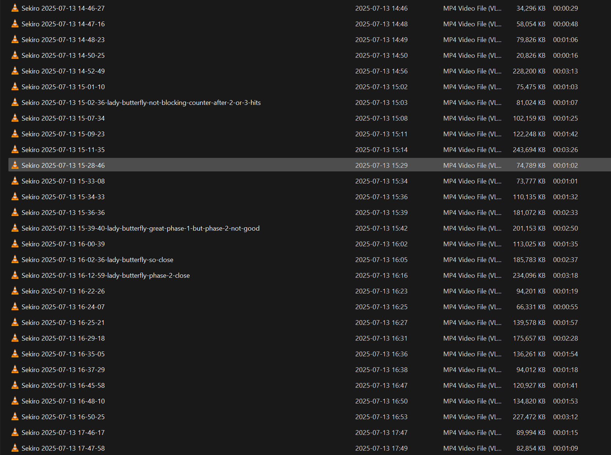

+++
date = '2025-07-27T11:48:04+05:30'
draft = false
title = 'Lessons learnt from Sekiro: Consistency is the key'
tags = ["life", "games"]
+++

## Introduction

This year I bought a new laptop since my old laptop was giving troubles. When selecting the laptop, I chose a laptop that would allow me to play some games in my free time - Lenovo Legion Slim 5 16AHP9, 16GB, RTX4050, 512GB. After the purchase, I had a great time playing old games that I couldn't play in my childhood (Prince of Persia - The Sands of Time, Two Thrones, Warrior Within, NFSMW 2005).

While I was looking for some recent games, I watched a YouTube video discussing must-play games. It mentioned the game "Sekiro: Shadows Die Twice". It had a Japanese background and I thought it would be great like the TV show Shogun. The video said it is a difficult game because you have to time the sword attacks precisely. Being curious, I thought to give it a try. "_How hard it can be, right?_"

## Sekiro: Shadows Die Twice

The game starts with a story in Japan. The player is a character who is a Shinobi (some kind of Ninja like person). The player is trying to protect his master who is a little kid.

With the guides in game, I could understand how to move forward in the game. This game is a bit different to other action/fighting games I have played before because of the posture system.

To defeat an enemy, you have to either damage his vitality (health) or posture. There are two bars that shows vitality and posture for both player and enemy.
Vitality bar is drained when you take damage. Posture bar is filled if you take damage to your posture. If vitality is over or posture is damaged fully, the enemy can kill you.

There is another interesting thing about defense techniques in Sekiro. You can either block or deflect an attack. You can block an attack, but it will do some amount of damage to your posture. So you can't keep blocking indefinitely. You can deflect an attack, and it would do damage to your enemy's posture. This is a bit difficult because you have to time your deflection but can learn with practice.

## Lessons Learnt

I am still playing this game and I don't think I am anywhere near to finish it. But thought of sharing some valuable insights I had while playing the game.

At the beginning of the game, the game felt just fine, although there were some new things. In this game, time to time you will have to face bosses. There are mini-bosses and bosses along the way. Mini-bosses are smaller versions of bosses and they are _supposed to be_ easier than bosses. Bosses are the real challenge that check your ability.

I faced few mini-bosses in the start and could manage them. Then I came across this mini-boss called "Juzou the Drunkard". 

Oh man, Juzou was really hard to defeat. At first, I was even intimidated to go near the enemy.

### Defeating Juzou the Drunkard

After countless attempts to defeat Juzou, I gave up. I mean "_What's the point of all this? Games are not supposed to be this hard. Games are supposed to be enjoyable... isn't it?_". I told to myself. I didn't play again for a couple of weeks.

But during one weekend, I thought "_Man, there must be a way. There must be people who faced the same difficulty as me_". So I checked YouTube and found a bunch of guides that showed how to defeat Juzou. They were talking about different _strategies_. Then I realized "_Ah, you must have a plan, you must have a strategy_". 


**Lesson 1**: 
You must have a plan or a strategy.


In Juzou's case, strategy consisted of
- what should I do in phase 1 and phase 2 - there are two phases: because bosses have two lives (same as the player)
- what attacks to look out for
- what are the attack patterns I should follow

Amidst all of this, I realized my fundamental abilities required for this game were not good. I wasn't good at deflecting or blocking. I wasn't looking for sweep attacks. So I returned to the training arena, and I practiced until I am confident.


**Lesson 2**: 
If you need to succeed in any domain, master the fundamentals.


After a few struggling weekends, I could finally defeat Juzou. Then came the disaster.

### Defeating Lady Butterfly

The game didn't allow me to just play around for another 5 mins after defeating Juzou. I had to face a boss called "Lady Butterfly" right after Juzou. 

Facing this boss really made me look like a clown. I mean the style of fighting was way different from Juzou. I felt like I am in a completely new territory. It was like I am back at square-1.

Again quit the game for couple of weeks questioning the purpose of playing this game, purpose of life, etc.

Same cycle again, watching some YouTube videos and back at the game trying.
I must mention [Katiecakes](https://www.youtube.com/@Katiecakes) YouTube channel.
It had [this](https://youtu.be/g5Mi7zvYkkA) informative guide on Sekiro.

One of the tips from Katiecakes was that she records all her game plays. It helps her to analyze her weaknesses. So I started recording myself playing Sekiro.

As you can see, there are many recordings. Most of them are failed attempts. But across these attempts, I was trying out different strategies. 
After many failed attempts, I felt like giving up, but kept trying.

If you play Sekiro long enough, you start to understand a pattern. I realized this during this stage. There's a pattern/style for each boss. They have their own weaknesses.  We have to just pay attention and leverage them. 


**Lesson 3**: 
Be consistent. You can achieve anything if you're consistent enough.


Eventually, I could defeat lady butterfly. It was a joyful moment. Then I realized it isn't the moment of defeating Lady butterfly that felt good, it was the journey I took. It was the countless attempts, the struggle I endured that felt good.


**Lesson 4**: 
The greatest feeling in the moment of success is looking back at the struggle you endured to achieve that success.


And finally, I must mention how great it feels to improve yourself at something (not only in gaming). You may start at a low-level or below-average. But trust me, if you are patient and consistent enough, you can become whoever you want.


**Lesson 5**: 
There is no pleasure like seeing yourself improving in any domain. It feels good to be competent.
