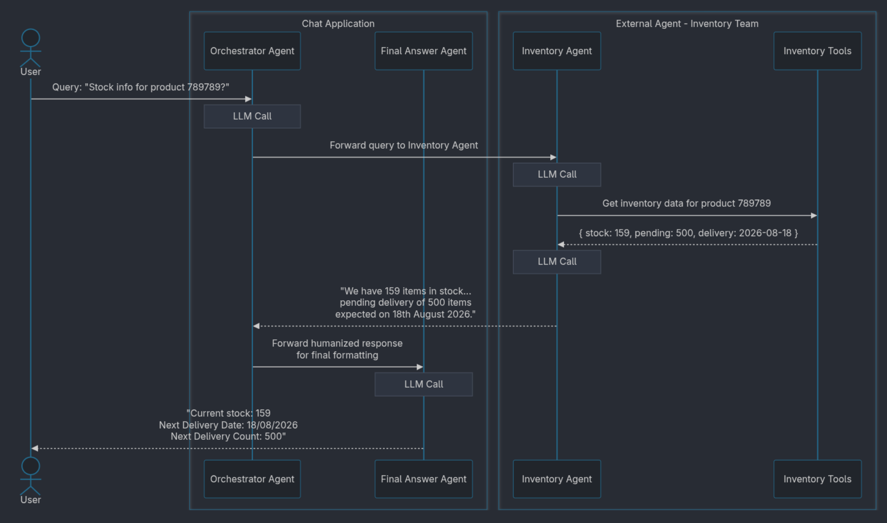
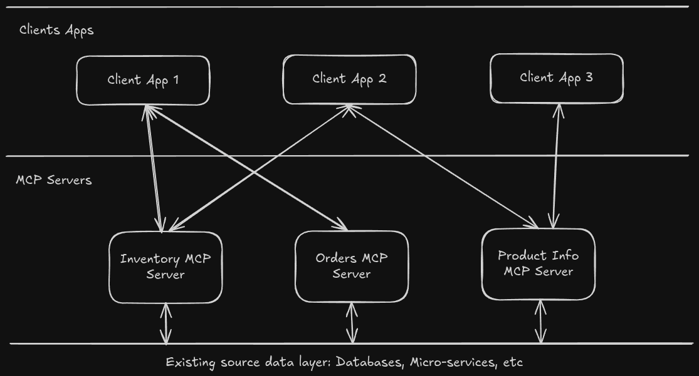

+++
date = '2026-07-27T12:00:14+05:30'
draft = false
title = 'The Middleman Nobody Asked For: Cutting Out Redundant LLM Calls'
tags = ["ai", "agents", "programming"]
+++

> [!question] TLDR
> Many AI agent-based applications suffer from redundant LLM calls because they generate humanized answers that are then discarded or reformatted. This increases latency, costs & risks losing meaning.
>
> As a solution, the article proposes building tools instead of agents.

Let me introduce the problem of redundant LLM calls happening in AI agent applications using an example.

## Conversational AI Assistant Example

A company has a conversational chat application that is powered by an agentic backend. It is used as an AI assistant for asking informational queries.

With the "AI Agents" hype, all teams in the company start building their own agents. They present these agents to leadership in demos. The agents look great individually. Seeing all these agents and their capabilities, the product team wants to integrate them into the conversational chat application mentioned above.

One such new agent called "Inventory Agent" is providing product inventory information based on the user query.

User query:

> Tell me about the stock information of 789789?

Inventory Agent Response:

> We have 159 items in stock of 789789 product. There is a pending delivery of another 500 items expected to be delivered on 18th August 2026.

Note the inventory agent is providing a humanized (natural language) response.

Now the chat application team has to do the integration. But they also have a set of requirements from the product team. The product team expects product information to be returned to the user in a format like below:

> Here are the stock information for product 789789:
>
> - Current stock: 159
> - Next Delivery Date: 18/08/2026
> - Next Delivery Count: 500

Based on the requirements, the chat application team comes up with the following design:

1. The chat application's orchestrator agent identifies that the inventory agent needs to be called based on the user query. (LLM Call #1)

2. The orchestrator agent calls the inventory agent with the user query.

3. The inventory agent decides which tools to invoke and gets requested information. (LLM Call #2)

4. The inventory agent returns its humanized response. (LLM Call #3)

5. The chat application's final answer agent generates an answer using the inventory agent response according to the product team's requirements. (LLM Call #4)

## Problem: Redundant LLM calls

If you look closely, there is a redundant step in the above design.

Even though in step 3 we get a humanized answer, we are not using it. We need to make another LLM call (#4) to format the chat application's final answer according to the app's needs.

## Why is this a problem?

- Adds to the latency, degrading the user experience

- Costs money by burning more tokens

- Meaning could be lost easily (structured data -> humanized response 1 -> humanized response 2 flow)

## How to solve?

> [!NOTE] Why not update the inventory agent to return the answer in the format required by the Chat Application?
>
> This tightly couples the inventory agent to the client application. What happens if another client application wants a different format from the Inventory Agent?

We need to first understand one thing. Most of these agents built by teams inside a company are not supposed to be used alone. At some point the requirement will arise to integrate this into one or more client applications to benefit end users.

At that point, we would notice that most client applications have their own orchestration and final answer generation layers.

I believe that "Building an Agent" for exposing domain-specific data that those teams have is not the right solution. Ideally, it should be a set of tools—an MCP server.

An MCP server can expose a set of tools for accessing the information internal to that team/vertical. Each client application would call those tools to get data and format the final answer however they want.

## Hype around Agents vs. Building Tools

I think most teams face this issue because they fall into the trap of blindly following the AI Agent hype. And the recognition and rewards from the leadership for building agents may be driving teams to only think about themselves but not at an organizational level.

> Hey, we built an AI Agent that answers all your inventory questions.

> Hey, we built an MCP server that allows any Agentic client application built in our organization to access inventory data.

I think many teams prefer the 1st statement over the 2nd because they get to demo an AI agent returning a nice humanized answer.

Ideally, the technical leadership should steer domain teams not to build fancy agents returning humanized answers but to build tools that act as a data/action layer that powers actual agents/client applications.

On a final note, all of this boils down to using the right tool for the right task.
